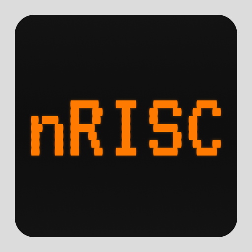

# Nano RISC

A simple virtual machine and an assembly language created for embedding in games as a scripting language.

## Structure

- `/ide` - a web IDE.
- `/web` - WASM bindings.
- `/cli` - a CLI application for running nRISC's code.
- `/asm` - an assembly language parser and compiler.
- `/arch` - nRISC's architecture types.
- `/vm` - a nRISC's VM realization.
